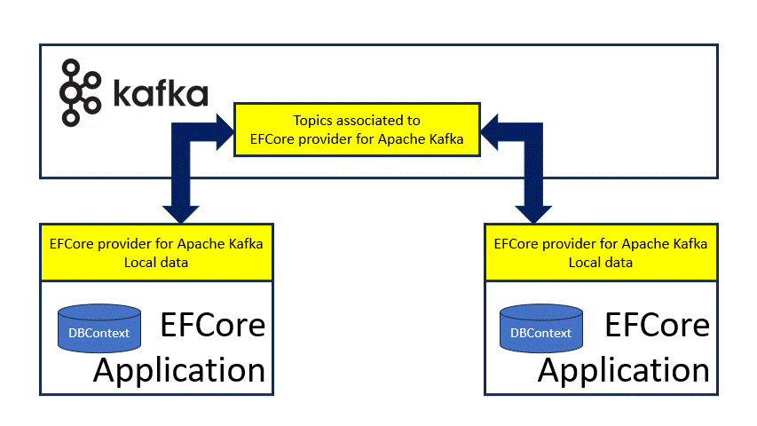
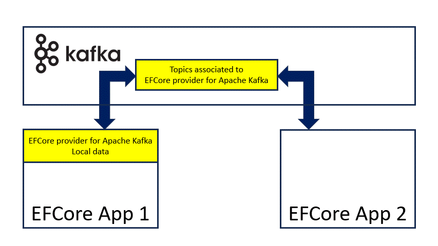

# KEFCore: how it works

[Entity Framework Core](https://learn.microsoft.com/it-it/ef/core/) provider for [Apache Kafka](https://kafka.apache.org/) can be used in some [operative conditions](usecases.md).

It is important to start with a simple description on how it works.
In the following chapters sometime it is used the term back-end and sometime Apache Kafka cluster: they shall be considered the same thing int the [Entity Framework Core](https://learn.microsoft.com/it-it/ef/core/) provider for [Apache Kafka](https://kafka.apache.org/) context.

## Basic concepts

Here below an image from Wikipedia describing simple concepts:

Simplifying there are three active elements:
- **Topics**: storage of the records (the data), they are hosted in the Apache Kafka cluster and can be partitioned
- **Producers**: entities producing records to be stored in one or more topics
- **Consumers**: entities receiving records from the topics

When a producer send a record to Apache Kafka cluster, the record will be sent to the consumers subscribed to the topics the producer is producing on: this is a classic pub-sub pattern.
Apache Kafka cluster adds the ability to store this information within the topic the producer has produced on, this feature guarantee that:
- an application consuming from the Apache Kafka cluster can hear only latest changes or position to a specific position in the past and start from that point to receive data
- the standard way to consume from Apache Kafka cluster is to start from the end (latest available record) or start from the beginning (first available record)

## How [Entity Framework Core](https://learn.microsoft.com/it-it/ef/core/) provider for [Apache Kafka](https://kafka.apache.org/) works

An application based on [Entity Framework Core](https://learn.microsoft.com/it-it/ef/core/) provider for [Apache Kafka](https://kafka.apache.org/) is both a producer and a consumer at the same time:
- when an entity is created/updated/deleted (e.g. calling [SaveChanges](https://learn.microsoft.com/en-us/ef/core/saving/basic)) the provider will invoke the right producer to store a new record in the right topic of the Apache Kafka cluster
- then the consumer subscribed will be informed about this new record and will store it back: this seems not useful till now, but it will be more clear later

Apache Kafka cluster becams a:
1. a central routing for data changes in [Entity Framework Core](https://learn.microsoft.com/it-it/ef/core/) based applications.
2. a reliable storage because, when the application restarts, the data stored in the topics will be read back from the consumers so the state will be aligned to the latest available.

Apache Kafka comes with [topic compaction](https://kafka.apache.org/documentation/#compaction) feature, thanks to it the point 2 is optimized.
[Entity Framework Core](https://learn.microsoft.com/it-it/ef/core/) provider for [Apache Kafka](https://kafka.apache.org/) is interested to store only the latest state of the entity and not the changes.
Using the [topic compaction](https://kafka.apache.org/documentation/#compaction), the combination of producer, consumer and Apache Kafka cluster can apply the CRUD operations on data:
- Create: a producer stores a new record with a unique key
- Read: a consumer retrieves records from topic
- Update: a producer storing a new record with a previously stored unique key will discard the old records
- Delete: a producer storing a new record with a previously stored unique key, and value set to null, will delete all records with that unique key

All CRUD operations are helped, behind the scene, from [`KNetCompactedReplicator`](https://github.com/masesgroup/KNet/blob/master/src/net/KNet/Specific/Replicator/KNetCompactedReplicator.cs) or [`KNetProducer`](https://github.com/masesgroup/KNet/blob/master/src/net/KNet/Specific/Producer/KNetProducer.cs)/[Apache Kafka Streams](https://kafka.apache.org/documentation/streams/).

### First-level cache

[`KNetCompactedReplicator`](https://github.com/masesgroup/KNet/blob/master/src/net/KNet/Specific/Replicator/KNetCompactedReplicator.cs) or [Apache Kafka Streams](https://kafka.apache.org/documentation/streams/) act as first-level cache of [Entity Framework Core](https://learn.microsoft.com/it-it/ef/core/): **data coming from the Apache Kafka cluster updates their content while the system is running**.
The behavior is intrinsic and does not need any extra call to the back-end.

### Data storage

Apache Kafka stores the information using records. It is important to convert entities in something usable from Apache Kafka.
The conversion is done using serializers that converts the Entities (data in the model) into Apache Kafka records and viceversa: see [serialization chapter](serialization.md) for more info.

## [Entity Framework Core](https://learn.microsoft.com/it-it/ef/core/) provider for [Apache Kafka](https://kafka.apache.org/) compared to other providers

In the previous chapter was described how [Entity Framework Core](https://learn.microsoft.com/it-it/ef/core/) provider for [Apache Kafka](https://kafka.apache.org/) permits to reproduce the CRUD operations.
Starting from the model defined in the code, the data are stored in the topics and each topic can be seen as a table of a database filled in with the same data.
From the point of view of an application, the use of [Entity Framework Core](https://learn.microsoft.com/it-it/ef/core/) provider for [Apache Kafka](https://kafka.apache.org/) is similar to the use of the InMemory provider.

### A note on [migrations](https://learn.microsoft.com/en-us/ef/core/managing-schemas/migrations)

The current version of [Entity Framework Core](https://learn.microsoft.com/it-it/ef/core/) provider for [Apache Kafka](https://kafka.apache.org/) does not support [migrations](https://learn.microsoft.com/en-us/ef/core/managing-schemas/migrations) explicitly.

## [Entity Framework Core](https://learn.microsoft.com/it-it/ef/core/) provider for [Apache Kafka](https://kafka.apache.org/) features not available in other providers

Here a list of features [Entity Framework Core](https://learn.microsoft.com/it-it/ef/core/) provider for [Apache Kafka](https://kafka.apache.org/) gives to its user and useful in some use cases.
The features below are strictly correlated with the consumers receiving back the record from Apache Kafka cluster described above.

### Distributed cache

In the previous chapter was stated that consumers align the application data to the last topics information.
The alignment is managed from [`KNetCompactedReplicator`](https://github.com/masesgroup/KNet/blob/master/src/net/KNet/Specific/Replicator/KNetCompactedReplicator.cs) and/or [Apache Kafka Streams](https://kafka.apache.org/documentation/streams/), everything is driven from the Apache Kafka back-end.
Considering two, or more, applications, sharing the same model and configuration, they always align to the latest state of the topics involved.
This implies that, virtually, there is a distributed cache between the applications and the Apache Kafka back-end:
- Apache Kafka stores physically the cache (shared state) within the topics and routes changes to the subscribed applications
- Applications use latest cache version (local state) received from Apache Kafka back-end

If an application restarts it will be able to retrieve latest data (latest cache) and aligns to the shared state.

### Events

Generally, an application based on [Entity Framework Core](https://learn.microsoft.com/it-it/ef/core/), executes queries to the back-end to store, or retrieve, information on demand.
The alignment (record consumed) can be considered a change event: so any change in the backend produces an event used in different mode:
- Mainly these change events are used from [`KNetCompactedReplicator`](https://github.com/masesgroup/KNet/blob/master/src/net/KNet/Specific/Replicator/KNetCompactedReplicator.cs) and/or [Apache Kafka Streams](https://kafka.apache.org/documentation/streams/) to align the local state;
- Moreover [Entity Framework Core](https://learn.microsoft.com/it-it/ef/core/) provider for [Apache Kafka](https://kafka.apache.org/) can inform, using callbacks and at zero cost, the registered application about these events.

Then the application can use the reported events in many modes:
- execute a query
- write something to disk
- execute a REST call
- and so on

> **IMPORTANT NOTE**: the events are raised from external threads and this can lead to [concurrent exceptions](https://learn.microsoft.com/en-us/ef/core/dbcontext-configuration/#avoiding-dbcontext-threading-issues) if the `KafkaDbContext` is used to retrieve information.

### Applications not based on [Entity Framework Core](https://learn.microsoft.com/it-it/ef/core/)

Till now was spoken about applications based on [Entity Framework Core](https://learn.microsoft.com/it-it/ef/core/), however this provider can be used to feed applications not based on [Entity Framework Core](https://learn.microsoft.com/it-it/ef/core/).
[Entity Framework Core](https://learn.microsoft.com/it-it/ef/core/) provider for [Apache Kafka](https://kafka.apache.org/) comes with ready-made helping classes to subscribe to any topic of the Apache Kafka cluster to retrieve the data stored from an application based on [Entity Framework Core](https://learn.microsoft.com/it-it/ef/core/).
Any application can use this feature to:
- read latest data stored in the topics from the application based on [Entity Framework Core](https://learn.microsoft.com/it-it/ef/core/) 
- attach to the topics involved from the application based on [Entity Framework Core](https://learn.microsoft.com/it-it/ef/core/) and receive change events upon something was produced 

The ready-made helping classes upon a record is received, deserialize it and returns back the filled Entity.
